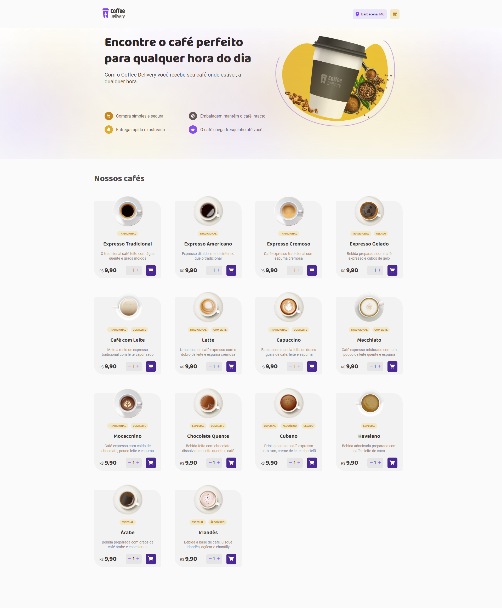

 ## 💻  Coffee Delivery

### 🔥 Introdução

O Coffee Delivery é um serviço de entrega de cafés variados, onde você pode escolher o café desejado, colocá-lo no carrinho e desfrutar à vontade daquele cafezinho que tanto gosta. O mesmo utiliza uma api
que facilita o preenchimento do seu endereco ao 
infomar seu cep.





 ## :rocket: Tecnologias

Esse projeto foi desenvolvido com as seguintes tecnologias:

✔️TypeScript

✔️React-vite

✔️Styled-components

✔️ axios

✔️Phosphor Icons

✔️ react-hook-form

✔️ zod

✔️ react-router-dom


## ⚙ Configuração

```
- $ git clone https://github.com/diegofchagas/coffe-delivery.git

- Para instalar as dependências:
> npm i

- Vá para a pasta do projeto

- Para iniciar a aplicação:
> npm run dev
```

### 🆙 Atualizações futuras

- Salvar pedidos no localStorage.
- Adicionar responsividade ao projeto.
- Adiconar useReducer ao mesmo.

## Desenvolvedor 
<span style="font-size: larger;">**Diego Chagas**</span>